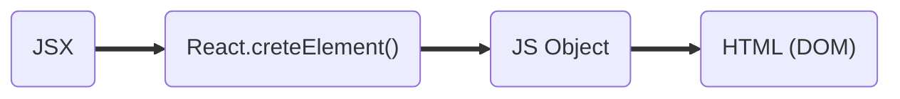
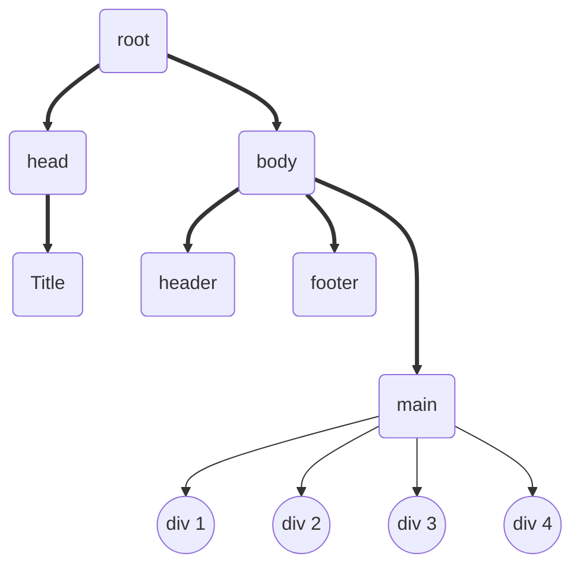

# React

- created a new folder petPooja.
- Created index.html with a root.
- Added text to root using javascript.
- Added react and react-dom cdn links.

  ```javascript
  const heading = React.createElement(
    "h1",
    { id: heading },
    "petPooja using react"
  );

  const root = ReactDOM.createRoot(document.getElementById("root"));

  root.render(heading);
  ```

- React.createElement returns a javascript object.
- The first argument is the html tag, second is the props (object) that we want to pass to react, third is the children.
- Root.render converts javascript object to DOM structure.
- render method overrides the root in html.
- Nested Structure in React.

  ```javascript
  const element = React.createElement("div", { id: "element" }, [
    React.createElement("div", { id: "firstChild" }, "first child"),
    React.createElement("div", { id: "secondChild" }, "second child"),
  ]);

  const root = ReactDOM.createRoot(document.getElementById("root"));
  ```

- To create sibling elements we pass data in array format.

# To-do

- [ ] What is emmet ?
- [ ] Difference between a Library and Framework?
- [ ] What is CDN? Why do we use it?
- [ ] What is crossorigin in script tag ?
- [ ] What is difference between async and defer ?
- [ ] Why is React known as React?
- [ ] What is diference between React and ReactDOM
- [ ] What is difference between react.development.js and react.production.js files via CDN?

Why use NPM?

> Our react app is powered by a lot of packages (minifiers, bundlers, optimizeers) and for that we need helper packages, that comes with npm.

To use import and export inside our js files, we need to add type="module" in the script tag.

What parcel is doing?

- **HMR** - Hot module replacement
- File watcher algorithm - written is c++
- **Bundling**
- **Minification**
- **Cleaning** our code
- Manages **dev** and **production** builds
- Superfast build algorithm
- **Image optimization**
- **Caching** while developing
- Compresses files
- Compatibility with older browsers
- **HTTPS** for development
- Manages port number

> Parcel has **Transitive dependencies** on other packages.

**Polyfills** are the code that are replacement of the newer versions of code.

Who converts our newer versions of code to older version?

> Bable

## JSX

- jsx is a html like syntax, but it is not html.



- babel converts JSX into React.createElement()

Why JSX?

> for better readability, maintainability of the code.

- to write javascript inside jsx we just have to use curly braces.

  ```
  {javascript inside jsx}
  ```

## React Components

- Component name should start with a capital letter.

1. **Functional Component** : A new way to create react components. Functional components are nothing but a **javascript** function that returns jsx.
2. **Class Based Component** : Older way of writing react components. It is a **javascript** class that returns jsx.

**Component Composition** : Component inside another component.

- Component can return only one jsx element.
- React.Fragment is a component which is exported by react.
- React.Fragment does not add any additional element on the page.

  ```javascript
  <React.Fragment>
    <h1>one jsx</h1>
    <h2>another jsx</h2>
  </React.Fragment>

  or

  <>
    <h1>one jsx</h1>
    <h2>another jsx</h2>
  </>
  ```

- **props**: Data passed to React components.
- Each child should have a unique key.
- **Vitrual Dom** is the representation of actual DOM structure.



<center style="padding: 21px; color:orange;" >
Virtual dom representation</center>

Reconciliation is an algorithm that finds the difference between one virtual dom to another virtual dom and determines the changes from the previous one.

Why keys for each child?

> When a new node is added to the DOM or removed from the DOM react reonceciliation finds the difference between previous and current virtual dom to get the changes in the virtual dom. If we don't pass the key to the child, react will have to rerender all the children that can slow down our application.
