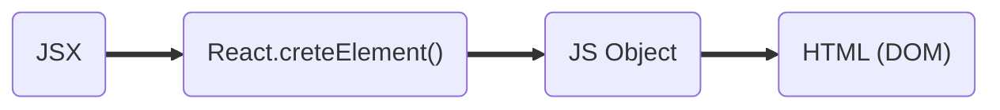
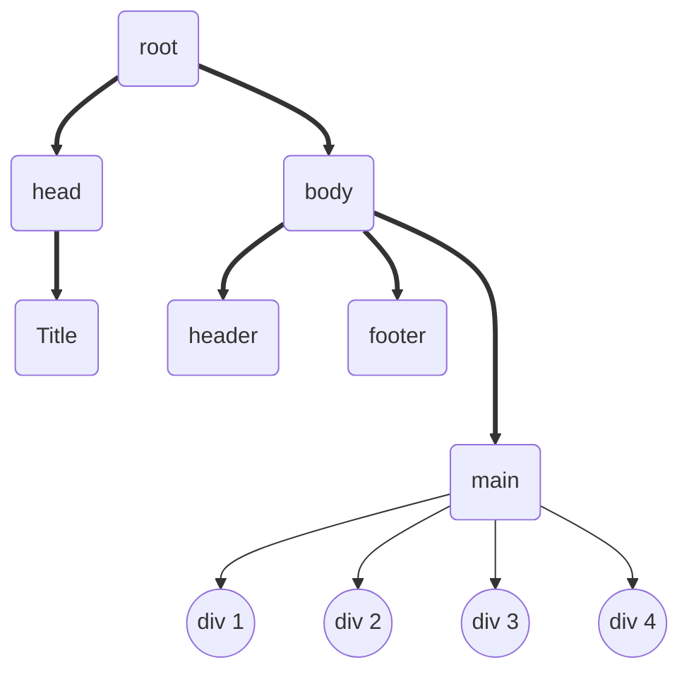

# React

- created a new folder petPooja.
- Created index.html with a root.
- Added text to root using javascript.
- Added react and react-dom cdn links.

  ```javascript
  const heading = React.createElement(
    "h1",
    { id: heading },
    "petPooja using react"
  );

  const root = ReactDOM.createRoot(document.getElementById("root"));

  root.render(heading);
  ```

- React.createElement returns a javascript object.
- The first argument is the html tag, second is the props (object) that we want to pass to react, third is the children.
- Root.render converts javascript object to DOM structure.
- render method overrides the root in html.
- Nested Structure in React.

  ```javascript
  const element = React.createElement("div", { id: "element" }, [
    React.createElement("div", { id: "firstChild" }, "first child"),
    React.createElement("div", { id: "secondChild" }, "second child"),
  ]);

  const root = ReactDOM.createRoot(document.getElementById("root"));
  ```

- To create sibling elements we pass data in array format.

# To-do

- [ ] What is emmet ?
- [ ] Difference between a Library and Framework?
- [ ] What is CDN? Why do we use it?
- [ ] What is crossorigin in script tag ?
- [ ] What is difference between async and defer ?
- [ ] Why is React known as React?
- [ ] What is diference between React and ReactDOM
- [ ] What is difference between react.development.js and react.production.js files via CDN?

Why use NPM?

> Our react app is powered by a lot of packages (minifiers, bundlers, optimizeers) and for that we need helper packages, that comes with npm.

To use import and export inside our js files, we need to add type="module" in the script tag.

What parcel is doing?

- **HMR** - Hot module replacement
- File watcher algorithm - written is c++
- **Bundling**
- **Minification**
- **Cleaning** our code
- Manages **dev** and **production** builds
- Superfast build algorithm
- **Image optimization**
- **Caching** while developing
- Compresses files
- Compatibility with older browsers
- **HTTPS** for development
- Manages port number

> Parcel has **Transitive dependencies** on other packages.

**Polyfills** are the code that are replacement of the newer versions of code.

Who converts our newer versions of code to older version?

> Bable

## JSX

- jsx is a html like syntax, but it is not html.



- babel converts JSX into React.createElement()

Why JSX?

> for better readability, maintainability of the code.

- to write javascript inside jsx we just have to use curly braces.

  ```
  {javascript inside jsx}
  ```

## React Components

- Component name should start with a capital letter.

1. **Functional Component** : A new way to create react components. Functional components are nothing but a **javascript** function that returns jsx.
2. **Class Based Component** : Older way of writing react components. It is a **javascript** class that returns jsx.

**Component Composition** : Component inside another component.

- Component can return only one jsx element.
- React.Fragment is a component which is exported by react.
- React.Fragment does not add any additional element on the page.

  ```javascript
  <React.Fragment>
    <h1>one jsx</h1>
    <h2>another jsx</h2>
  </React.Fragment>

  or

  <>
    <h1>one jsx</h1>
    <h2>another jsx</h2>
  </>
  ```

- **props**: Data passed to React components.
- Each child should have a unique key.
- **Vitrual Dom** is the representation of actual DOM structure.



<center style="padding: 21px; color:orange;" >
Virtual dom representation</center>

Reconciliation is an algorithm that finds the difference between one virtual dom to another virtual dom and determines the changes from the previous one.

Why keys for each child?

> When a new node is added to the DOM or removed from the DOM react reonceciliation finds the difference between previous and current virtual dom to get the changes in the virtual dom. If we don't pass the key to the child, react will have to rerender all the children that can slow down our application.

## Class Based Components

- MyComponent extending the React.Component to inherit functionality from React.Component. It also let React know that we are trying to create a new component.
- render() is the only mandatory method to create a class based component.
- Every thing is initialized in constructor

## React Lifecycle

1. First constructor() is called then render() is called.
2. componentDidMount() is called after the component is rendered.

```javascript
import React from "react";

class MyComponent extends React.Component {
  constructor(props) {
    super(props);

    this.state = { count: 0, userCount: 0 };
    console.log("constructor is called at the very beginning of the component");
  }

  conponentDidMount() {
    console.log("componentDidMount will be called after the initial render");
  }

  componentDidUpdate() {
    console.log(
      "componentDidUpdate will be called after the componentDidMount and the render() method is called"
    );
  }

  componentwillUnmount() {
    console.log(
      "componentWillUnmount will be called just before the component will be destroyed"
    );
  }

  render() {
    const { count, userCount } = this.state;
    console.log("render is called just after constructor");
    return (
      <div>
        <h1>My Component</h1>
        <p> {this.props.name}</p>
        <p> {count}</p>
        <p> {userCount}</p>
        <button
          onClick={() => {
            this.setState({ count: 1, userCount: 1 });
          }}
        >
          Increment
        </button>
      </div>
    );
  }
}
```

Two phases of react lifecycle.

1. render phase
2. commit phase
3. 

## React Hook

- Hooks are just utility functions.

  ### useState()

  - useState is used to create a new state local state variable.
  - useState returns an array, that contains a state variable and a function that can modify the state variable.
  - useState takes a value and set is as initial value for the state variable.

  ```javascript
  const [variableName, setVariableName] = useState(initialStateValue);
  ```

  Why useState()?

  > React does not keep track of the local variables. So if we create a variable and change its value, react will not know that the variable value has changed. One the other hand React keeps track of the state variables and rerender the component each time the state variable changes.

  ### useEffect()

  - useEffect is a hook that has two parameters first a callback function and second is a dependency array.
  - useEffect is called depending on the dependency array value.

  ```javascript
  // If we pass a dependency array, useEffect()) will be called every time the dependency array changes.

  useEffect(() => {
    callbackFunction();
  }, [dependencyArray]);
  ```

  ```javascript
  // If we pass an empty array, useEffect() will be called only once after the initial render has finished.

  useEffect(() => {
    callbackFunction();
  }, []);
  ```

  ```javascript
  // If we do not pass a dependency array, useEffect() will be called after every render.

  useEffect(() => {
    callbackFunction();
  });
  ```

  Why useEffect()?

  > When we want our component to rerender after the initial render has finished, we use useEffect.

## Monolith Architecture

All the features offered by the aap are in the same big project. Even for a small change in one feature of the app, we have to build the deploy the whole application again.

## Microservices architecture (Single responsibility)

All the features offered by the app can have separate microservices and can be used independently. Even if we change some feature in a microservice, we just have to deploy that microservice. This made the whole application easier to maintain and test.

# Routing

1.**createBrowserRounter** : createBrowserRounter comes from react-router-dom. To use this we have to create our configuration for the path. createBrowserRounter takes an array of objects. Each object has a path, element, an errorElement (optional) and children array(optional for nested routing). The errorElement loads the error page.

```javascript
import { createBrowserRounter } from "react-router-dom";

const appConfig = createBrowserRounter([
  {
    path: "/",
    element: <App />,
    errorElement: <Error />,
    children: [
      { path: "/", element: <RestaurantCards /> },
      { path: "/restaurant/:id", element: <RestaurantDetails /> },
    ],
  },
  { path: "/about", element: <About />, errorElement: <Error /> },
  { path: "/contact", element: <Contact />, errorElement: <Error /> },
]);
```

**Note** : To use dynamic routing, use use :param in the url.

2.**RouterProvider** : RouterProvider also comes from react-router-dom. We render RouterProvider to our root so that we can access the elements depending on the path of the url.

```javascript
import { RouterProvider } from "react-router-dom";

root.render(<RouterProvider router={appConfig} />);
```

3.**useRouteError** : useRouteError is a hook provided by react-router-dom. This gives us the details of the error.

```javascript
import { useRouteError } from "react-router-dom";

const error = useRouteError();
```

4.**Link** : Provided by react-router-dom to go to certain routes. It is same as anchor tag in html but it does not reload the page.

```javascript
import { Link } from "react-router-dom";

const App = ()=>{
  <Link to="/">App</Link>
  <Link to="/contact">Contact</Link>
  <Link to="/about">About</Link>
}
```

5.**Outlet** : Outlet is a React component provided by react-router-dom. It wil be filled by the path configuration.

```javascript
import { Outlet } from "react-router-dom";

const App = () => {
  <Outlet />;
};

// Outlet will be replaced by the component refering to the path configuration.
```

6.**useParams** : useParams is a hook provided by react-router-dom. This returns the dynamic path url from browser tab.

```javascript
import { useParams } from "react-router-dom";

const params = useParams();
```

# Lazy Loading

Also calldd **Chunking**, **On Demand Loading**, **Code Splitting**, and **Dynamic Bundling**.

- we lazy load using lazy() function provided by react.
- lazy() takes a function that import the component we want to lazy load.
- This import is different from the javascript import statement.
- When we lazy load a component react will suspend it as we don't have code yet.
- To avoid this situation we can wrap the component in Suspense (provided by react).
- Suspense also takes an optional fallback prop. Fallback can have any piece of jsx.

```javascript
import { lazy, Suspense } from "raect";

const lazyComponent = lazy(() => import("path of the component"));

appConfig = createBrowserRouter([
  {
    path: "/lazy",
    element: (
      <Suspense fallback={<Shimmer />}>
        <lazyComponent />
      </Suspense>
    ),
  },
]);
```

# Props drilling

When we have data in our parent component and we need this data in the child component (2, 3) layers down, we pass the props to child then again child until we reched the destination layer. This is known as the **props drilling**.

Why props drilling is not a good choice to share data between components?

- While passing data, data goes through lots of different components that may not need this data.

- When we update the data, all our components will have to render unnecessarily.

# Context

When we need our data all across aur app, we store the data in a central file. **Redux store** does the same thing.

Using context, we don't have to pass props to all the components. We just store the context in a file and use it whenever we need the context.

**Context is like useState for the whole application.**

```javascript
import { createContext } from "react";

const UserContext = createContext({
  user: {
    name: "Test user",
    email: "test@example.com",
  },
});

export default UserContext;
```

For Functional Components

```javascript
import { useContext } from "react";
import UserContext from "path";

const { user } = useContext(UserContext);

// Now we can use user in our app.
```

For Class based Components

```javascript
import UserContext from "path";

<UserContext.Consumer>
  {(valueOfUserContext) => {
    console.log(valueOfUserContext);
  }}
</UserContext.Consumer>;
```

What if we want to modify the context or use it for a specific component only?

```javascript
import UserContext from "path";


// Parent component
const [user, setUser] = useState({name:"Real User", email: "realuser@example.com", description: "description", password: "password"})
<>
  <UserContext.Provider value={user}>
    <ComponentOne />
    <ComponentTwo />
    <ComponentThree />
  </UserContext.Provider>;
  <ComponentFour />
</>
```

Here ComponentFour will get the value of UserContext's old value. But all the components inside UserContext.Provider will have updated value for user.

# Redux and Redux store

- We uses redux to manage our data layer.
- When our application grows, It becomes difficult to manage all the context components.
- It is complex to setup.
- It has huge learning curve.
- Redux store is a big object.
- We will have single store to hold all the context components.
- We can create slices in the store (i.e. logical separation of our store).
- Components can't directly modify the store.
- Components dispatches an action and that action will call a function (Reducer) and that function (Reducer) will modify the store.
- **When we click on the button, it dispatces an action that calls the reducer function that updates the slice of the store.**
- We use selector (subscribe) to read data from the store.

- @reduxjs/toolkit is the core library that maintains the store.
- react-redux is the bridge between react and redux.

1. Create a store

```javascript
import { configureStore } from "@reduxjs/toolkit";
import cartSlice from "path";

const store = configureStore({
  reducer: {
    cart: cartSlice,
  },
});

export default store;
```

2. Provider provides the store to our application. We can choose where to pass the store, we can pass the store to whole app or to just few components.

```javascript
import { Provider } from "react-redux";
import store from "path";

// parentcomponent
<Provider store={store}>
  <App />
</Provider>;
```

3. Creating a slice

```javascript
import { createSlice } from "@reduxjs/toolkit";

const cartSlice = createSlice({
  name: "cart",
  initialState: { items: [] },
  reducers: {
    addItems: (state, action) => {
      state.items.push(action.payload);
    },
    removeCart: (state, action) => {
      state.items.splice(state.items.indexOf(action.payload), 1);
    },
    clearCart: (state) => {
      state.items = [];
    },
  },
});

export const { addItems, removeCart, clearCart } = cartSlice.actions;

export default cartSlice.reducer;
```

4. Put the slice into the store (provided in step 1)
